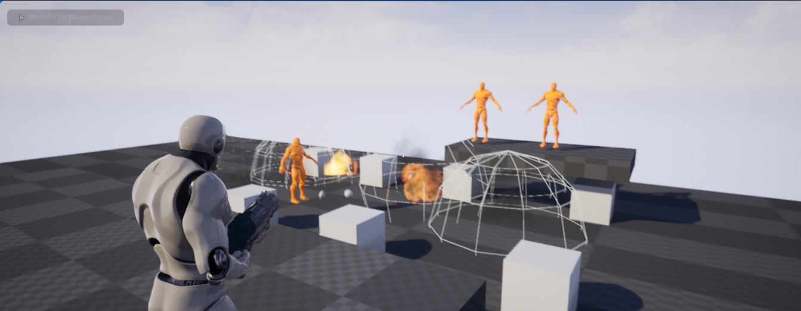

# coop-game-fleep

[](https://github.com/filfreire/coop-game-fleep/actions/workflows/build.yml)

This is my personal repo with exercises, experiments and classwork of the <https://www.udemy.com/course/unrealengine-cpp> class.
It was forked and is related to [@tomlooman](https://github.com/tomlooman)'s original work on: <https://github.com/tomlooman/CoopHordeShooter>



> Note repository is in a WIP state.

- [coop-game-fleep](#coop-game-fleep)
  - [Prerequisites](#prerequisites)
  - [How to build](#how-to-build)
  - [How to run tests](#how-to-run-tests)
  - [How to package and run](#how-to-package-and-run)
  - [Problems using the project locally](#problems-using-the-project-locally)
    - [Unable to find package errors](#unable-to-find-package-errors)
    - [Error opening project about bStrictConformanceMode](#error-opening-project-about-bstrictconformancemode)
    - [Checking CUDA is properly setup](#checking-cuda-is-properly-setup)
    - [Installing clang unreal engine toolchain for Linux cross compilation on Windows](#installing-clang-unreal-engine-toolchain-for-linux-cross-compilation-on-windows)
    - [Disabling UBA when compiling on Linux](#disabling-uba-when-compiling-on-linux)
    - [Random seed and timeout example](#random-seed-and-timeout-example)
  - [Headless Training Examples](#headless-training-examples)
    - [Example 1: Basic Training with Timeout](#example-1-basic-training-with-timeout)
    - [Example 2: Advanced Hyperparameter Tuning](#example-2-advanced-hyperparameter-tuning)
    - [Example 3: Training with Obstacles](#example-3-training-with-obstacles)
    - [Available Parameters](#available-parameters)
    - [Monitoring Training](#monitoring-training)
    - [Example Training Scripts](#example-training-scripts)
  - [Multiple headless runs](#multiple-headless-runs)
    - [Running batch on Windows example](#running-batch-on-windows-example)
    - [Running batch on Linux example](#running-batch-on-linux-example)

## Prerequisites

For Windows 10/11:

- Install [Unreal Engine 5.2](https://www.unrealengine.com/en-US/download) (and all needed sub-dependencies)
- Install [Visual Studio 2022](https://visualstudio.microsoft.com/vs/)
- Install all dependencies mentioned on [official documentation](https://dev.epicgames.com/documentation/en-us/unreal-engine/setting-up-visual-studio-development-environment-for-cplusplus-projects-in-unreal-engine?application_version=5.4)
  - .NET desktop development 
  - Desktop development with C++
  - Universal Windows Platform development
  - Game Development with C++
  - (also mentioned)
    - C++ profiling tools
    - C++ AddressSanitizer
    - Windows 10 SDK (10.0.18362 or Newer)
    - Unreal Engine installer


(Tested on a Windows 10 Pro, version 22H2)

> For Linux/MacOS: `Not used yet, work in progress`


## How to build

First, clone the repository, make sure you have everything listed on **Prerequisites** setup and then `cd` into the cloned folder.

Use `.\scripts\Build.bat` batch file to compile/build the project:

```powershell
# UNREAL_PATH - Unreal engine install path, e.g. C:\Epic Games\UE_5.2
# PROJECT_NAME - project name, e.g. CoopGameFleep.uproject

.\scripts\Build.bat $env:UNREAL_PATH (Get-Location).Path $env:PROJECT_NAME
```

## How to run tests

To run tests, use the `.\scripts\RunTests.bat` batch file:

```powershell
# UNREAL_PATH - Unreal engine install path, e.g. C:\Epic Games\UE_5.2
# PROJECT_NAME - project name, e.g. CoopGameFleep.uproject
# TEST_SUITE_TO_RUN - e.g. CoopGameFleepTests.
# TEST_REPORT_FOLDER - e.g. TestResults
# TEST_LOGNAME - e.g. RunTests.log

.\scripts\RunTests.bat $env:UNREAL_PATH (Get-Location).Path $env:PROJECT_NAME $env:TEST_SUITE_TO_RUN $env:TEST_REPORT_FOLDER $env:TEST_LOGNAME
```

## How to package and run

To package a game build for Win64 platform, r   un `.\scripts\Package.bat` on a Powershell terminal:

```powershell
# UNREAL_PATH - Unreal engine install path, e.g. C:\Epic Games\UE_5.2
# PROJECT_NAME - project name, e.g. CoopGameFleep.uproject
# TARGET_NAME - name of target, e.g. CoopGameFleep
# PACKAGE_FOLDER - Folder name where to place the packaged game binaries, e.g. PackageResults

.\scripts\Package.bat $env:UNREAL_PATH (Get-Location).Path $env:PROJECT_NAME $env:TARGET_NAME $env:PACKAGE_FOLDER
```

If packaging works successfully, you should see a log like:

```plaintext
UATHelper: Packaging (Windows): ********** ARCHIVE COMMAND COMPLETED **********
UATHelper: Packaging (Windows): BuildCookRun time: 636.56 s
UATHelper: Packaging (Windows): BUILD SUCCESSFUL
UATHelper: Packaging (Windows): AutomationTool executed for 0h 10m 37s
UATHelper: Packaging (Windows): AutomationTool exiting with ExitCode=0 (Success)
```

And you should see a packaged build in `PACKAGE_FOLDER` (or the `-archivedirectory` you've picked in case you edit the `.\scripts\Package.bat` batch file).

> Note: First packaging is can take between 10 to 20 minutes. This is what it took on an AMD Ryzen 7 5800 processor and an Intel Core i7 6700k. It might take longer or less time depending on your specs.

## Problems using the project locally

### Unable to find package errors

I see a handful of errors when I try to run project from VSCode like:

```plaintext
Unable to find package (...)
Unable to find package (...)
Unable to find package (...)
```

Try to use solution documented in <https://stackoverflow.com/a/70584286>

### Error opening project about bStrictConformanceMode

When converting from Engine version 5.2 to 5.4, I see errors like:

```
modifies the values of properties: [ bStrictConformanceMode ]
```

There's some documentation about it <https://forums.unrealengine.com/t/build-failed-in-unreal-5-4/1789560/9>, editing `CoopGameFleepEditor.Target.cs` and `CoopGameFleep.Target.cs` files with

```
DefaultBuildSettings = BuildSettingsVersion.V5;
bOverrideBuildEnvironment = true;
```

appears to have solved the issue.

### Checking CUDA is properly setup

```powershell
.\Intermediate\PipInstall\Scripts\python.exe -c "import torch; print('CUDA available:', torch.cuda.is_available()); print('CUDA version:', torch.version.cuda if torch.cuda.is_available() else 'N/A')"
```

### Installing clang unreal engine toolchain for Linux cross compilation on Windows

Download `https://cdn.unrealengine.com/CrossToolchain_Linux/v25_clang-18.1.0-rockylinux8.exe`

Install and reboot.

Run `./scripts/build-linux.ps1`

### Disabling UBA when compiling on Linux

Create file `~/.config/Epic/UnrealBuildTool/BuildConfiguration.xml` with contents like:

```xml
<?xml version="1.0" encoding="utf-8" ?>
<Configuration xmlns="https://www.unrealengine.com/BuildConfiguration">
        <BuildConfiguration>
                <bAllowUBAExecutor>false</bAllowUBAExecutor>
                <bAllowUBALocalExecutor>false</bAllowUBALocalExecutor>
        </BuildConfiguration>
</Configuration>
```

### Random seed and timeout example

```powershell
.\scripts\run-training-headless.ps1 -RandomSeed 42 -LearningRatePolicy 0.0005 -EpsilonClip 0.1
```

## Headless Training Examples

The project includes a comprehensive headless training system with configurable hyperparameters, timeouts, and obstacle systems. Here are practical examples:

### Example 1: Basic Training with Timeout

Run training for 30 minutes with custom hyperparameters:

```powershell
.\scripts\run-training-headless.ps1 -TimeoutMinutes 30 -RandomSeed 1234 -LearningRatePolicy 0.0003 -LearningRateCritic 0.001 -EpsilonClip 0.2
```

**Parameters explained:**
- `-TimeoutMinutes 30`: Training will stop after 30 minutes
- `-RandomSeed 1234`: Reproducible random behavior
- `-LearningRatePolicy 0.0003`: Policy network learning rate
- `-LearningRateCritic 0.001`: Critic network learning rate
- `-EpsilonClip 0.2`: PPO clipping parameter

### Example 2: Advanced Hyperparameter Tuning

Experiment with different PPO settings and batch sizes:

```powershell
.\scripts\run-training-headless.ps1 -TimeoutMinutes 60 -RandomSeed 5678 -LearningRatePolicy 0.0001 -LearningRateCritic 0.0005 -EpsilonClip 0.15 -PolicyBatchSize 2048 -CriticBatchSize 8192 -IterationsPerGather 64 -DiscountFactor 0.995 -GaeLambda 0.9 -ActionEntropyWeight 0.01
```

**Advanced parameters:**
- `-PolicyBatchSize 2048`: Larger batch size for policy updates
- `-CriticBatchSize 8192`: Larger batch size for critic updates
- `-IterationsPerGather 64`: More training iterations per data collection
- `-DiscountFactor 0.995`: Higher reward discount for long-term planning
- `-GaeLambda 0.9`: Generalized Advantage Estimation parameter
- `-ActionEntropyWeight 0.01`: Encourages exploration

### Example 3: Training with Obstacles

Train agents to navigate around obstacles in both static and dynamic modes:

```powershell
# Static obstacles - same positions throughout training
.\scripts\run-training-headless.ps1 -TimeoutMinutes 45 -UseObstacles $true -MaxObstacles 10 -MinObstacleSize 80 -MaxObstacleSize 250 -ObstacleMode "Static" -LearningRatePolicy 0.0002

# Dynamic obstacles - regenerated each episode
.\scripts\run-training-headless.ps1 -TimeoutMinutes 45 -UseObstacles $true -MaxObstacles 15 -MinObstacleSize 50 -MaxObstacleSize 300 -ObstacleMode "Dynamic" -LearningRatePolicy 0.0002

# No obstacles - baseline comparison
.\scripts\run-training-headless.ps1 -TimeoutMinutes 45 -UseObstacles $false -LearningRatePolicy 0.0002
```

**Obstacle parameters:**
- `-UseObstacles $true`: Enable obstacle system
- `-MaxObstacles 10`: Number of obstacles to spawn
- `-MinObstacleSize 80`: Minimum obstacle size
- `-MaxObstacleSize 250`: Maximum obstacle size
- `-ObstacleMode "Static"`: Obstacles stay in same positions
- `-ObstacleMode "Dynamic"`: Obstacles regenerate each episode

### Available Parameters

**Training Control:**
- `-TimeoutMinutes`: Training duration (0 = run indefinitely)
- `-RandomSeed`: Random seed for reproducibility
- `-MapName`: Training map to use

**PPO Hyperparameters:**
- `-LearningRatePolicy`: Policy network learning rate (default: 0.0001)
- `-LearningRateCritic`: Critic network learning rate (default: 0.001)
- `-EpsilonClip`: PPO clipping parameter (default: 0.2)
- `-PolicyBatchSize`: Policy batch size (default: 1024)
- `-CriticBatchSize`: Critic batch size (default: 4096)
- `-IterationsPerGather`: Training iterations per gather (default: 32)
- `-NumberOfIterations`: Total training iterations (default: 1000000)
- `-DiscountFactor`: Reward discount factor (default: 0.99)
- `-GaeLambda`: GAE lambda parameter (default: 0.95)
- `-ActionEntropyWeight`: Action entropy weight (default: 0.0)

**Obstacle Configuration:**
- `-UseObstacles`: Enable/disable obstacles (true/false)
- `-MaxObstacles`: Maximum obstacles to spawn (default: 8)
- `-MinObstacleSize`: Minimum obstacle size (default: 100.0)
- `-MaxObstacleSize`: Maximum obstacle size (default: 300.0)
- `-ObstacleMode`: Obstacle behavior ("Static" or "Dynamic")

### Monitoring Training

Monitor training progress in real-time:

```powershell
# View training logs
Get-Content -Path "scharacter_training.log" -Wait

# View TensorBoard (in another terminal)
.\scripts\run-tensorboard.ps1
```

### Example Training Scripts

Run pre-configured examples:

```powershell
# See all obstacle configuration examples
.\scripts\run-training-with-obstacles.ps1
```

## Multiple headless runs

- Logs are saved into `\coop-game-fleep\TrainingBuild\Windo ws\CoopGameFleep\Saved\Logs\{logfilename}.log`

### Running batch on Windows example

```powershell
## **1. Deactivated Obstacles (No Obstacles)**
.\scripts\run-batch-training.ps1 -StartSeed 1 -EndSeed 5 -TimeoutMinutes 10 -UseObstacles $false -ResultsDir "results_NoObstacles_5Seeds_10min"
```

```powershell
## **2. Active Static Obstacles**
.\scripts\run-batch-training.ps1 -StartSeed 1 -EndSeed 5 -TimeoutMinutes 10 -UseObstacles $true -ObstacleMode "Static" -ResultsDir "results_StaticObstacles_5Seeds_10min"
```

```powershell
## **3. Active Dynamic Obstacles**
.\scripts\run-batch-training.ps1 -StartSeed 1 -EndSeed 5 -TimeoutMinutes 10 -UseObstacles $true -ObstacleMode "Dynamic" -ResultsDir "results_DynamicObstacles_5Seeds_10min"
```


### Running batch on Linux example

```bash
## **1. Deactivated Obstacles (No Obstacles)**
./scripts/run-batch-training.sh --start-seed 1 --end-seed 5 --timeout-minutes 10 --use-obstacles false --results-dir "BatchTrainingResults_NoObstacles_5Seeds_10min"
```

```bash
## **2. Active Static Obstacles**
./scripts/run-batch-training.sh --start-seed 1 --end-seed 5 --timeout-minutes 10 --use-obstacles true --obstacle-mode "Static" --results-dir "BatchTrainingResults_StaticObstacles_5Seeds_10min"
```

```bash
## **3. Active Dynamic Obstacles**
./scripts/run-batch-training.sh --start-seed 1 --end-seed 5 --timeout-minutes 10 --use-obstacles true --obstacle-mode "Dynamic" --results-dir "BatchTrainingResults_DynamicObstacles_5Seeds_10min"
```
