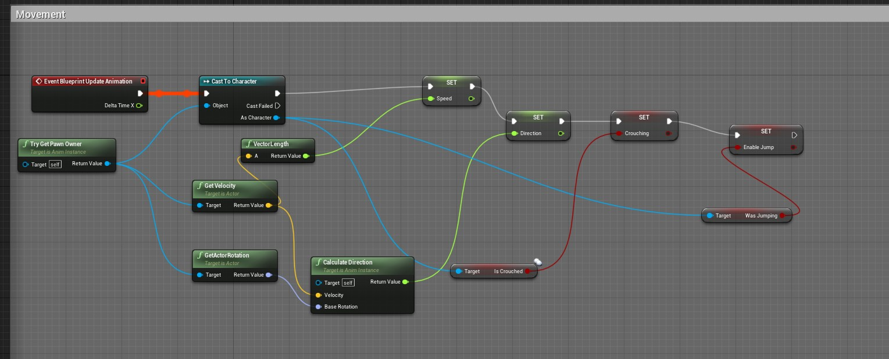

# Fixing the direction not working bug

Related issue: [#1](https://github.com/filfreire/coop-game-fleep/issues/1)

Example video/notes: https://www.youtube.com/watch?v=J3N9oM6_oe4

## Analysis and Fix

- Initially considered that I might have broken skeleton structure when trying to import another mesh, and saved it somehow in between commits for other stuff.
- The last working version I could find where walking and crouching had direction was still "working", showing some reaction to direction, was in commit [add character animations (782d46b)](https://github.com/filfreire/coop-game-fleep/commit/782d46b17cd8fef04631be841962b8bc5e68d539).

It turned out that in the `UE4ASP_HeroTPP_AnimBlueprint` I didn't have the `SET Direction` element's `Exec` input in the blueprint properly connected.

The blueprint looked like this after the fix:

